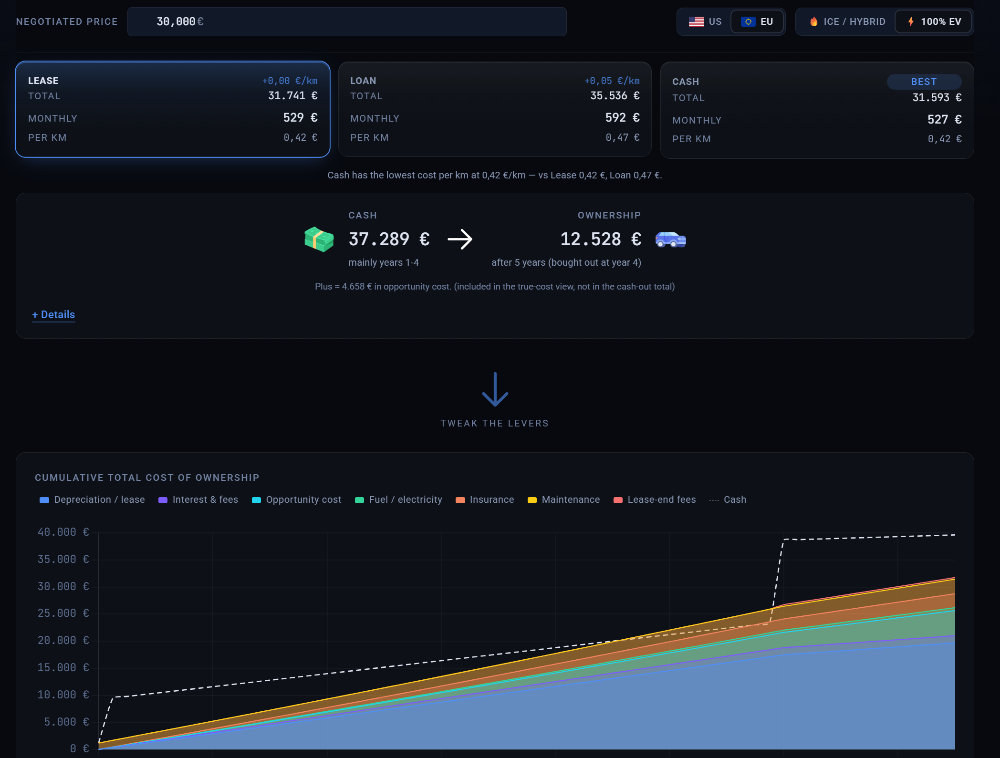

# What's My Real Vehicle Cost

> The monthly payment is not the cost.

A total-cost-of-ownership (TCO) calculator that shows what a car *really* costs you over the years you plan to keep it — financing, depreciation, opportunity cost, fuel/electricity, insurance, and maintenance, all on one chart, side by side across **lease, finance, and cash**.

[](https://github.com/elekktrisch/whats-my-real-vehicle-cost/actions/workflows/deploy.yml)
[](https://elekktrisch.github.io/whats-my-real-vehicle-cost/)
[](https://angular.dev)
[](https://tailwindcss.com)
[](https://playwright.dev)

**Try it →** <https://elekktrisch.github.io/whats-my-real-vehicle-cost/>



<!-- TODO: capture and commit docs/screenshot.png — comparison page on desktop, chart visible, all three modes in the strip. -->

## Why

Most car-cost calculators stop at the monthly payment. The interesting comparison — *lease vs. finance vs. cash* — turns on the layers most shoppers never see: depreciation curve, opportunity cost on the down payment, lease-end fees, fuel/electricity at your locale's rates, insurance scaled by vehicle category, maintenance growing with mileage and age. This app puts all of those on one chart so the cross-mode comparison stays apples-to-apples.

## Features

- **Three financing modes side-by-side** in a sticky comparison strip — lease, loan, cash — with the recommended option (lowest cost-per-distance) marked **Best**
- **Cash-out overlay line** on the chart visualizes the gap between *cash you write checks for* and *what it actually costs you* (opportunity cost + depreciation framing)
- **Lease modes**: rolling lease (handback) with cycle-aware fees, or buyout with owned-tail depreciation. Early-termination penalty when you exit before term.
- **Locale-aware**: US (USD, miles, mpg, $/gal) and EU (EUR, km, L/100km, €/L) defaults; auto-detected from browser timezone
- **Powertrain-aware**: ICE / EV with locale-correct efficiency units, electricity vs. gas pricing, optional home-charger install + solar
- **URL-as-state**: every input shareable via a single `?s=<encoded-json>` param. Returning users skip the splash; share links carry the exact scenario.
- **Mobile-first**: touch-friendly sliders, sticky comparison strip, hero compaction on scroll
- **Accessibility**: keyboard-navigable tablist, ARIA-pressed legend toggles, sr-only data table mirroring the chart, `prefers-reduced-motion` respected

## Tech stack

- **[Angular 21](https://angular.dev)** — standalone components, signals everywhere, no NgModules
- **[Chart.js 4](https://www.chartjs.org)** + ng2-charts for the cumulative TCO chart
- **[Tailwind CSS 4](https://tailwindcss.com)** — utility-first with project-defined color/font tokens
- **[fflate](https://github.com/101arrowz/fflate)** for share-URL compression
- **Karma + Jasmine** for pure-logic unit tests; **[Playwright](https://playwright.dev)** for end-to-end happy-case rendering
- Deployed via **GitHub Pages** from the `master` branch (workflow in `.github/workflows/deploy.yml`)

## Quick start

```bash
npm install
npm start                # dev server at http://localhost:4200
```

### Tests

```bash
npm test -- --watch=false --browsers=ChromeHeadless    # one-shot unit tests
npm run e2e:install                                     # one-time: download Playwright Chromium
npm run e2e                                             # end-to-end happy-case suite
npm run e2e:ui                                          # Playwright UI mode for debugging
```

### Build

```bash
npm run build           # production build → dist/car-leasing-chart/browser/
```

## Project structure

```
src/app/
  scenario/                     domain types, store, locale config, pure calc functions (+ specs)
    calculations/               tco-{lease,finance,cash,shared}.ts + tco.ts dispatcher
    scenario.store.ts           central signal store
    scenario.persistence.ts     URL autosave + cross-field clamping effects
    scenario.serializer.ts      ?s=<json> autosave + ?c=<compressed> share encoding
  shared/
    atoms/                      button, toggle, number-input, icon, label, divider, hero-column
    molecules/                  comparison-strip, mode-card, hero-summary, page-header,
                                global-controls, your-situation, lease-end-section,
                                maintenance-display, disclosure, slider-group
    pipes/                      money pipe (locale-aware currency formatter)
  features/
    mode-detail-view/           per-mode field components + chart + global controls below the chart
    chart/tco-chart/            stacked-area Chart.js renderer + cash-out overlay line
  pages/
    splash-page/                cold-start intro card
    comparison-page/            sticky stack + chart + controls
    app-shell/                  splash vs comparison-page based on hasReturningState()
e2e/                            Playwright happy-case specs
playwright.config.ts            two viewports: desktop 1280×800, mobile 390×844
```

For deeper docs:
- [`PRODUCT.md`](./PRODUCT.md) — product vision and user-facing model
- [`ARCHITECTURE.md`](./ARCHITECTURE.md) — code-level architecture
- [`CLAUDE.md`](./CLAUDE.md) — agent-targeted notes (commands, conventions, deploy)
- [`USE_CASES.md`](./USE_CASES.md) — example scenarios

## Contributing

Patches welcome — see [`CONTRIBUTING.md`](./CONTRIBUTING.md) for the dev loop, code conventions, and where to look first.

## License

[MIT](./LICENSE) © Roman Schlegel.

## Disclaimer

This is a side project. The numbers are rough estimates with simplifying assumptions baked in (depreciation curves, locale defaults, category multipliers). Useful for a sanity check; not a substitute for the actual contract from your dealer, a real insurance quote, your own math, or a financial advisor with credentials. Don't sign a five-figure deal because a chart on a stranger's website said so.
